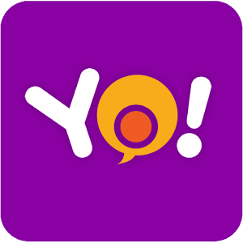

Welcome to Yo's documentation!
==================================================

**Yo** is a user-friendly programming language for movie production. It offers a convenient way to do non-linear video editing by a few lines of scripts. Users can produce videos from varieties of sources such as images or existing video clips and apply system- or user-defined functions to perform seamless video editing such as clip construction, duration adjustment, subtitle burning. In this light, **Yo**'s objective is to facilitate editing on videos and to reduce human effort involved in production.

Contents:

.. toctree::
   :maxdepth: 3
   :glob:

   getting-started
   a-tour-of-yo
   language-reference
   authors
